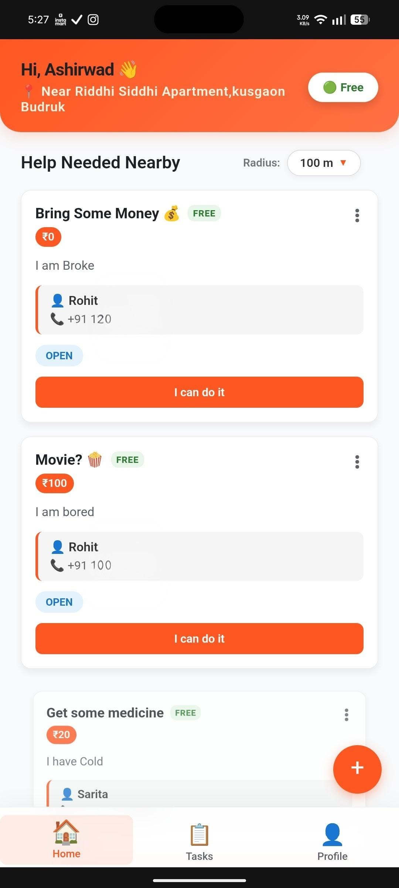
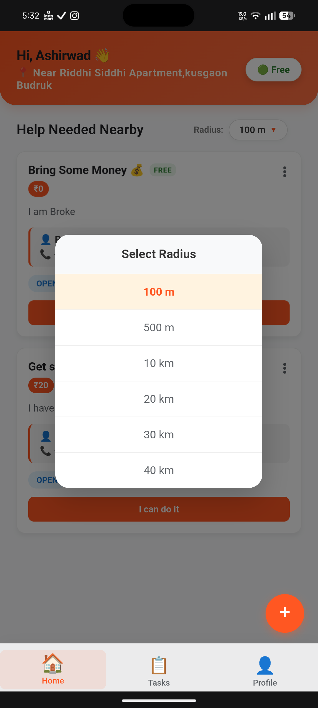

# 🤝 Helpido

> **Your community network for getting things done.**

Helpido is a hyperlocal, real-time community assistance Progressive Web App (PWA). It connects neighbors who need help with everyday tasks to people nearby who can lend a hand, utilizing geospatial radius filtering and instant WebSockets.

🌐 **[Live Demo](https://helpido.onrender.com)** *(Open on mobile for the best PWA experience!)*

---

## ✨ Key Features

* **📍 Geospatial Radius Filtering:** Built with MongoDB's `2dsphere` indexing and the Haversine formula to strictly filter tasks within a user's chosen radius (100m to 40km).
* **💬 Real-Time Chat Engine:** Integrated `Socket.io` for instant 1-to-1 messaging between task posters and helpers.
* **🔔 Native Web Push Notifications:** Custom Service Worker implementation for background notifications, complete with smart deep-linking and active-foreground suppression.
* **📱 Installable PWA:** Fully responsive, app-like UI with iOS-style spring animations, frosted glass modals, and a native "Install App" flow.
* **🔒 Secure Authentication:** Custom OTP-based login system for fast, password-less entry.

---

## 🛠️ Tech Stack

**Frontend:**
* HTML5 / CSS3 / Vanilla JavaScript
* Service Workers & Web Push API
* Custom CSS Spring Physics & Animations

**Backend:**
* Node.js & Express.js
* Socket.io (Real-time WebSockets)
* MongoDB Atlas (with Geospatial Indexes)
* Web-Push (VAPID implementation)

---

## 📸 Screenshots
*(Add your screenshots to an `assets` folder in your repository and update these image links)*

| Home Feed | Real-Time Chat | Radius Picker |
| :---: | :---: | :---: |
|  |  |  |

---

## 🚀 Local Installation

Want to run Helpido locally? Follow these steps to get your local development environment set up.

**1. Clone the repository:**
```bash
git clone https://github.com/ashirwadsingh857-beep/Helpido.git
cd Helpido
```

**2. Install dependencies:**
```bash
npm install
```

**3. Set up Environment Variables:**
Create a `.env` file in the root directory of the project and add your database and VAPID keys:
```env
PORT=3000
MONGO_URI=your_mongodb_connection_string
VAPID_PUBLIC_KEY=your_public_key
VAPID_PRIVATE_KEY=your_private_key
VAPID_EMAIL=mailto:your_email@example.com
```

**4. Run the server:**
```bash
node server.js
```

**5. Open the app:**
Visit `http://localhost:3000` in your web browser. 

---

## 📄 License
This project is licensed under the MIT License - see the [LICENSE](LICENSE) file for details.
